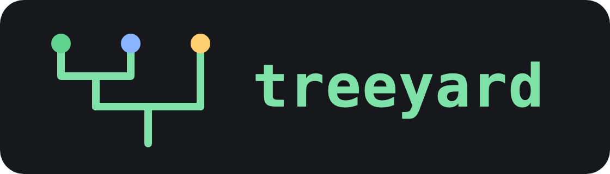
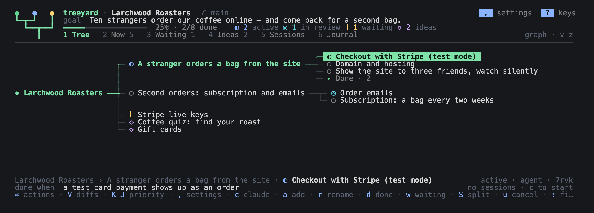
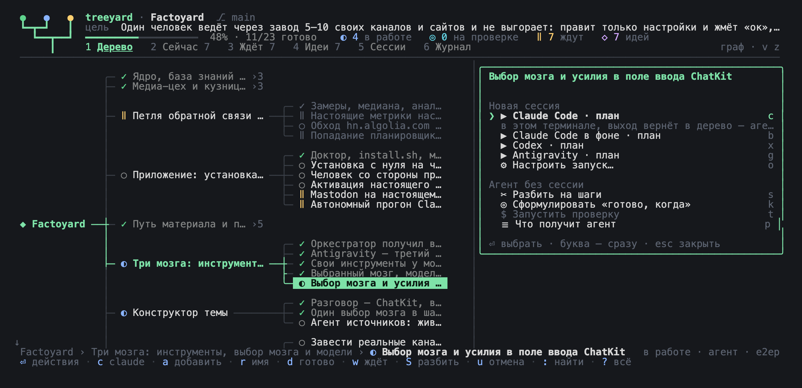

<p align="center"></p>

Дерево целей проекта в терминале. Корень — цель, которую видно в жизни; ветки —
этапы и направления; листья — задачи с критерием «готово, когда». Из любого узла
открывается сессия Claude Code, Codex или Antigravity — и потом находится и в
дереве, и в самом CLI (`claude --resume`, `codex resume`).

Знак — три листа в цветах статусов дерева (готово, в работе, ждёт), сходящиеся в
один ствол: работа, которая собирается в цель.



## Запуск

Нужен Node.js 22+. Brainyard приходит из npm (`@antondanv/brainyard`).
Для сессий в панелях нужен tmux (`brew install tmux` на macOS).

```sh
npm install && npm run build && npm link   # команда treeyard
cd ../Factoyard && treeyard                # открыть дерево проекта
treeyard init                              # новое дерево: с агентом или по шаблону
treeyard init --agent --brain codex        # сразу с агентом, без мастера
treeyard import                            # агент молча читает план проекта и строит дерево
```

Treeyard по умолчанию запускает React/Ink в режиме `production`, чтобы анимации
не накапливали отладочные замеры в памяти. Явно заданный `NODE_ENV` сохраняется;
для отладки React можно запустить `NODE_ENV=development npm run dev`.

## Посадить дерево с агентом

В папке без дерева `treeyard` открывает мастер на весь экран: **с агентом**
(Claude Code, Codex или Antigravity) или **сам, по шаблону**.

Агент получает скилл [`treeyard-init`](skills/treeyard-init/SKILL.md) и ведёт
так:

1. **Смотрит, где мы.** В пустой папке просит выложить всё, что ты думаешь о
   проекте, сплошным текстом. В проекте изучает код, документы и историю и даёт
   короткий отчёт: что реально работает, что обещано и не сделано, где хвосты.
2. **Задаёт вопросы.** По 1–3 за раз, каждый со своим предложением, так что
   часто хватает «да». Не больше ~12, только то, что определяет форму дерева.
   Ничего, что видно из репозитория. Мелочи вроде языка README — сразу узлами
   в набросок.
3. **Договаривается о цели и первой вехе — именно в таком порядке.**
   - В корень идёт большая цель проекта: зачем он вообще существует («один
     человек ведёт через завод 5–10 своих каналов и не выгорает»), а не
     «сделать MVP».
   - Первой веткой идёт первая веха: ближайшая проверка в жизни («неделю веду
     канал только через бота»).
   - Плюс аппетит: сколько времени готов вложить до этой вехи.
4. **Спрашивает про шаги в мире, а не в коде.** Сервер, домен, оплата, договор,
   живой пользователь. Они сразу встают в дерево узлами «делает: ты», а не
   копятся в конце, где раньше вставали проекты.
5. **Показывает набросок дерева текстом.** Ходячий скелет первым, у каждого узла
   «готово, когда», блокеры — «ждёт», идеи — отдельной веткой. Сажает одной
   командой (`treeyard import --from-json -`) только после твоего «да».
6. **Пишет короткие документы вместо прежних десяти.** `docs/vision.md`,
   `AGENTS.md` как единственный источник правил, `CLAUDE.md` из одной строки
   `@AGENTS.md`. План и задачи живут в дереве.

С tmux разговор открывается справа, а слева дерево появляется и растёт по мере
посадки. Ввод сразу идёт агенту; `⌃Q` возвращает управление дереву, `f` — разговору,
`F` — разговор на весь экран. Ничего запускать после посадки не нужно.
Без tmux (или с настройкой `open=terminal`) агент работает на весь экран и в конце
говорит: «выйди из сессии — откроется дерево».

Чтобы тот же скилл знали обычные
`claude`, `codex` и `agy` в любой папке:

```sh
treeyard skills            # где скилл и куда он установлен
treeyard skills install    # ~/.claude/skills, ~/.codex/skills, ~/.gemini/config/skills
```

## Как это выглядит

- **Граф** (по умолчанию): цель слева, ветки растут вправо, родитель — посередине
  своих детей. Узел — одна строка, поэтому на экране помещается всё рабочее дерево.
  Дети стоят сразу за названием своего родителя, а листья берут место, оставшееся
  справа: короткое «Готовые · N» не отодвигает своих детей, длинные названия режутся реже.
  Выбранный узел — зелёная «таблетка», путь к нему от корня подсвечен; если его
  название не влезает, оно медленно и плавно едет до конца и обратно, с паузами на концах.
  `z` — те же узлы карточками, `v` — дерево отступами, как список.
  При открытой сессии ширина карточек подстраивается под место слева. В узком
  списке длинные отступы сокращаются с `…`, сохраняя статус и название узла.
  При открытой сессии граф и карточки смещаются к рабочей ветке; корень остаётся
  левее, к нему можно сдвинуться через `⌥←` или перейти к верхней ветке.
  Подписи агента переходят в компактный вид: `⠋ claude` — работает,
  `? claude` — ждёт тебя, `▣ codex` — открытая панель агента;
  они видны и на выбранном узле, с отступом от выделенного названия.
- **Полоса внизу**: где ты, что значит «готово» для этого узла (или чего он ждёт)
  и что с его сессиями — агент работает, ждёт тебя или сессий нет.
  Место в первую очередь получает название выбранного узла и его статус;
  промежуточный путь сокращается до `…`, если целиком не помещается.
- **Вкладки**: `1` дерево · `2` сейчас — всё, что можно делать прямо сейчас по всем
  веткам · `3` ждёт — заблокированные ветки с причиной и условием возврата ·
  `4` идеи · `5` сессии папки — по группам Claude Code, Codex, Antigravity (`← →` между ними) ·
  `6` журнал — что происходило в дереве.



Из корня `c` запускает ревью всего дерева агентом проекта; `⏎` открывает меню с ревью
и разговором о статусе. В «Другой агент, место, модель…» (`o`) выбираются Claude Code,
Codex или Antigravity, панель или терминал; Claude также может работать в фоне.
Агент получает цель, обзор узлов, «Сейчас», «Ждёт», последние журналы, правила и решения.
Ревью сначала выдаёт находки и команды `treeyard`, изменения — после согласия.
В разговоре первое сообщение твоё: спросить о статусе, завести или закрыть узлы.
Сессии проекта хранятся в `.tree/tree.md`, видны в меню корня и во вкладке «Сессии»
как принадлежащие `◆` проекту; `f` продолжает панель, `x` усыпляет её.

## Клавиши

Буквенные команды работают и в русской раскладке с тех же клавиш: `р о л д` —
это `h j k l`, `ф` — `a`, `Ф` — `A`. Это действует в дереве, списках, меню и
диалогах; Shift сохраняет смысл команды. Русский текст в поиске, формах и
панелях агентов вводится как обычно.

| | |
| --- | --- |
| `↑ ↓` `← →` | по колонке графа · к родителю и к детям (`j k` — все узлы подряд); с верхнего уровня `←` — к корню `◆` |
| `space` `+` `−` | свернуть ветку · раскрыть всё · свернуть всё |
| `:` или `⌃K` | палитра: найти любой узел или действие по словам |
| `/` | фильтр дерева по названию |
| `⏎` | всё про узел: продолжить сессию, начать новую, агент без сессии, проверка |
| `c` `b` | Claude Code по узлу (в панели, если есть tmux) · в фоне |
| `f` `F` `x` `p` | сессия справа: печатать в неё · во весь экран · усыпить · скрыть (подробнее ниже) |
| `a` `A` | новый узел внутрь · рядом — строкой внизу; длинный текст переносится и виден весь (`tab` — с критерием) |
| `r` `e` `E` | переименовать · поля и описание узла · узел в редакторе |
| `d` `w` `s` | готово · ждёт с причиной · любой статус |
| `G` | GitHub: подключить доску (мастер) или свериться с подключённой |
| `I` | картинки узла: скрин из буфера (`v`), подпись (`n`), на весь экран (`o` — в полном размере в Preview), удалить (`D`); файл картинки можно перетащить в окно |
| `V` | дифы узла: связанные коммиты → файлы → цветной диф; также в меню `⏎` и палитре `:` |
| `P` | документы проекта: все `.md` — читать с разметкой и править встроенным редактором; также `⏎` на корне `◆` |
| `S` | агент разбивает узел на 3–7 шагов, ты отмечаешь, какие добавить (кто разбивает — выбираешь в подтверждении) |
| `t` | запустить проверку узла (команду из поля «проверка») |
| `u` | отменить последнее изменение |
| `tab` `⇧tab` | вложить · поднять на уровень |
| `K` `J` или `⇧↑` `⇧↓` | поднять · опустить приоритет среди соседей одного статуса (также в меню `⏎` и палитре `:`) |
| `⌥` + стрелки | сдвинуть граф · `f` — вернуться к выбранному |
| `v` `z` `i` `.` | список ↔ граф · строки ↔ карточки · панель деталей · готовое |
| `,` | настройки |
| `?` `q` | все клавиши (не влезают — `↑↓` `PgUp` `PgDn` листают) · выход |

В окне «Изменить узел» (`e`) есть многострочное поле «Описание»: `Enter` — новая
строка, `↑↓` — курсор по строкам, `←→` — по тексту. Вставка сохраняет переносы строк;
длинный текст переносится по ширине, видимая часть следует за курсором.
`Tab` / `Shift+Tab` переключают поля, `Ctrl+S` сохраняет всё окно; в остальных
полях `Enter` также сохраняет. `Esc` отменяет правки, `u` в дереве отменяет
сохранение. Журнал сохраняется отдельно от описания. Для редактирования всего
Markdown-файла, включая журнал, по-прежнему есть `E` из дерева.

У каждого родителя узлы идут по статусу, по умолчанию: **в работе → на проверке →
к работе → ждёт → идея → готово → отказ**. Внутри одного статуса порядок задаёшь сам
сверху вниз; он сохраняется в `order` узлов, виден в CLI и `.tree/README.md`, `u`
отменяет перестановку. Смена статуса автоматически переносит узел в соответствующую
часть. Порядок статусов настраивается — «Порядок статусов» в `,` или
`treeyard config status_order`:

| Шаблон | Сверху вниз |
| --- | --- |
| `active-first` — в работе сверху (по умолчанию) | в работе → на проверке → к работе → ждёт → идея → готово → отказ |
| `done-first` — готовые сверху | готово → в работе → на проверке → к работе → ждёт → идея → отказ |
| `active-last` — в работе снизу | идея → ждёт → к работе → на проверке → в работе → готово → отказ |
| `custom` — свой | как расставишь: `⏎` на строке «Порядок статусов» открывает список статусов, `K` `J` или `⇧↑` `⇧↓` двигают, `⏎` сохраняет |

Подтверждённые готовые узлы собраны в свёрнутую группу **«Готовые · N»** — в конце
ветки или там, где «готово» в выбранном порядке. Выбери группу и нажми `space`
(или `⏎`), чтобы раскрыть её; `space` сворачивает обратно. `+` раскрывает и эти
группы. Узлы «на проверке» остаются видимыми. Поиск `/` и палитра `:` находят и
готовые узлы; внутри группы доступны их сессии и действия.
Группа меняет только отображение: родители, история и файлы узлов остаются прежними.

### Мышью

| | |
| --- | --- |
| клик | выбрать узел в графе и в списке (и корень `◆`), строку в «Сейчас», «Ждёт», «Идеях», «Журнале», «Сессиях» · переключить вкладку |
| двойной клик | то же, что `⏎`: действия узла, открыть сессию, из журнала — к узлу; в меню — выбрать пункт |
| клик по `▸` `▾` или `›4` | раскрыть или свернуть ветку в списке · раскрыть свёрнутую ветку в графе и шагнуть в неё |
| клик по подсказке | нажать её клавишу: подсказки внизу экрана, `,` `?` в шапке, кнопки панели сессии и подвалов диалогов |

Клик по подсказке — это ровно нажатие её клавиши, так что мышь делает то же, что
клавиатура. Пока открыт диалог, дерево слева клики не принимает.

## Подтверждение и настройки

Перед каждой сессией и задачей агента treeyard спрашивает: какой узел, кто
(Claude Code, Codex, Antigravity), где (в панели, в этом терминале или в фоне), как начать,
модель — и показывает первое сообщение, которое уйдёт агенту. `⏎` запустить,
`o` поменять параметры, `esc` отмена, `!` больше не спрашивать.
`treeyard open` из shell спрашивает так же (`--yes` — без вопроса).

Доступ Claude Code и Codex берут из своих настроек. У Antigravity там есть только
plan и accept-edits, и он спрашивает перед каждой командой, поэтому treeyard
запускает и возобновляет его с полным доступом (`--dangerously-skip-permissions`).

Перед «Разбить на шаги» и «Сформулировать «готово, когда»» подтверждение — маленькая
форма: мозг (Claude Code, Codex, Antigravity), модель и усилие выбираются `←→`, поле —
`↑↓`. Сначала там мозг проекта и `assist_model`; другой выбор действует только на эту
задачу, настройки проекта не меняются. Усилие, которого у модели нет (у Haiku его нет
вовсе), агенту не передаётся.

Настройки — клавиша `,` (она всегда подписана в правом верхнем углу) или `treeyard config`:

| Для всех проектов (`~/.treeyard/settings.json`) | |
| --- | --- |
| `lang` | `ru` или `en` — интерфейс, шаблоны и то, что получают агенты |
| `confirm` | подтверждать запуск сессий и задач агента |
| `theme` | `dark` или `light` — под цвет терминала |
| `animation` | спиннеры и мигающий лист |
| `marquee` | бегущее название: длинное название выбранного узла прокручивается, чтобы прочитать его целиком |
| `status_order` | порядок статусов у каждого родителя: `active-first` (по умолчанию), `done-first`, `active-last`, `custom` или все семь статусов через запятую — свой |
| `live` | живые статусы сессий Claude Code, Codex и Antigravity: кто работает, кто ждёт тебя |
| `open` | открывать сессии в панели (`pane`, по умолчанию) или в терминале (`terminal`); без tmux — в терминале |
| `sleep_after` | усыплять после 15/30/60 минут простоя (по умолчанию 30); `0` — выключить |
| `max_panes` | лимит живых панелей проекта: 3/5/8 (по умолчанию 5); `0` — без предела |
| `notes` | папка с деревом, куда `treeyard note` пишет замечания из любого проекта; `off` — убрать. В `,` — «Куда падают замечания»: путь (`~`, `.` — этот проект), пусто — убрать |

При включённом `live` работающий Codex показывает спиннер у узла и входит в
«работает агентов» сверху, в том числе в длинной сессии. Вопрос или запрос
разрешения в панели показывает «ждёт тебя»; после ответа или отмены ожидание
снимается на следующем обновлении. Статусы обновляются каждые 3 секунды.
Верхний счётчик учитывает сессии, привязанные к узлам этого дерева.

| Этот проект (`.tree/tree.md`) | |
| --- | --- |
| `brain` | мозг по умолчанию: claude, codex, antigravity |
| `start` | как начинать сессию: plan, do, goal, chat |
| `model`, `effort` | модель и усилие сессий — выбираются из списка, который отдаёт сам CLI |
| `assist_model` | модель для «разбить на шаги» и критерия — можно дешевле |

Модели не нужно вписывать руками: treeyard спрашивает их у CLI (`codex debug models`,
`agy models`; у Claude Code — псевдонимы fable, opus, sonnet, haiku, они всегда
означают последнюю версию). Усилие предлагается только то, что понимает выбранная
модель, `*` — её усилие по умолчанию. Модель и усилие относятся к мозгу проекта:
при смене мозга они сбрасываются. Те же списки — в окне запуска (`o`).

```sh
treeyard config                 # всё, что настроено
treeyard config lang en         # English
treeyard config confirm off     # не спрашивать перед запуском
treeyard config sleep_after 15  # усыплять после 15 минут подтверждённого простоя
treeyard config max_panes 3     # до трёх панелей; работающие и видимые защищены
treeyard config status_order done-first  # готовые сверху
treeyard config status_order todo,review,active,waiting,idea,done,dropped  # свой порядок
treeyard config notes ~/Projects/Treeyard  # куда падают замечания
TREEYARD_LANG=en treeyard       # язык на один запуск
```

## Сессии рядом с деревом

Сессия, открытая «в панели», живёт в tmux: её экран виден справа от дерева, в неё
можно печатать, не выходя из treeyard, а закрытие treeyard её не останавливает —
при следующем запуске она снова в своём узле. Так работают все три CLI.

| | |
| --- | --- |
| `f` или клик по панели | печатать в сессию: всё, включая стрелки, вставку и `⌃C`, уходит в CLI |
| `⌃Q` или клик по дереву | обратно к дереву |
| `F` | во весь экран; `⌃Q` — назад в дерево |
| `x` | усыпить: CLI закрывается и отдаёт память, разговор остаётся в его истории |
| `f` на узле со спящей сессией | разбудить: тот же разговор в новой панели (с подтверждением) |
| `p` | скрыть или показать панель |
| `⇧←` `⇧→` или `<` `>` | шире, уже — граница панели идёт за стрелкой; клик по `⇧← ⇧→` в правом углу панели — то же |
| колесо · `PgUp` `PgDn` · `End` | история панели · по страницам · к живому экрану |
| протянуть мышью по экрану панели | выделить и скопировать в буфер обмена (Treeyard держит мышь, поэтому выделяет сам) |

Вверху справа видно, сколько сессий живо и сколько они занимают памяти
(Claude Code — около 200–300 МБ, Codex — около 80, Antigravity — около 350).
Treeyard читает экран только той сессии, что на виду, остальные не трогает. Тихие
сессии засыпают сами (`sleep_after`, по умолчанию через 30 минут простоя), а когда
живых больше `max_panes` (по умолчанию 5), засыпает самая давно простаивающая.
Работающая, ждущая тебя или открытая на экране сессия не засыпает никогда.
Сессия, в которой не было ни одного сообщения, не засыпает, а просто закрывается:
CLI не сохраняет пустой разговор, и будить было бы нечего.

Во вкладке «Сессии» (`5`) выбери сессию и нажми `x` — усыпится именно она,
даже если её панель скрыта или она запущена в фоне через `b`. Фоновые сессии
Claude Code останавливаются его командой `stop`; разговор и привязка к узлу
сохраняются. В списке появится `☾ спит`, `⏎` продолжит тот же разговор.
Ручное усыпление остановит и работающую сессию. Сессию, открытую во весь экран
или в другом терминале, сначала закрой там.

Сессии папки, которых нет ни в одном узле, помечены `без узла` — их открыли мимо
дерева. Над списком — сколько сессий было за 14 дней и сколько из них мимо дерева;
то же в конце `treeyard sessions`. Привязать такую сессию к узлу — `l`.

Нужен tmux: `brew install tmux`. У treeyard свой сервер tmux (`tmux -L brainyard`),
твой собственный tmux и его настройки он не трогает.

## Агенты и дерево

Сессия из узла получает короткий контекст: путь от корня (зачем это), критерий,
соседей, правила проекта и команды дерева. Агенты пишут обратно теми же
командами, что и человек:

```sh
treeyard show                                   # дерево; treeyard show <id> — узел
treeyard add "Показать продукт человеку" --who human --parent <id>
treeyard set <id> status=waiting waiting="нет сервера" until="появится VPS"
treeyard set <id> status=review                 # агент; «готово» ставит человек
treeyard log <id> "что сделано; что осталось"
treeyard note "справка не помещается в экран"   # замечание о treeyard — в «Замечания»
treeyard image <id> shot.png --note "…"        # картинка к узлу (скрин, доказательство)
treeyard diff <id> --add <sha>                  # привязать свой коммит к узлу для проверки
treeyard add "Codex: статус хода" --project ../Brainyard --for <id>   # нужна правка в другом проекте
treeyard open root --start plan --pane         # ревью дерева в панели
treeyard open root --start chat --brain codex   # разговор о проекте
treeyard open <id> --brain codex                # сессия по узлу прямо из shell
treeyard open <id> --brain codex --pane         # запустить панель и вернуться в shell
treeyard sessions                               # сессии папки во всех CLI, «без узла» — мимо дерева
```

Отмена (`u`) возвращает только твои изменения: если агент успел поправить тот же
узел, его правка останется.

### Корень и документы проекта

Корень `◆ <проект>` — тоже остановка: `←` с ветки верхнего уровня, клик по нему
или `↑` с первой строки списка. У корня своя карточка (`i`): цель, прогресс,
документы проекта и как ведётся дерево. `⏎` на корне — меню проекта: документы,
«Цель, правила и решения» (`.tree/tree.md`), настройки, новая ветка.

`P` (в русской раскладке — `З`) из любого места открывает «Документы»: все `.md`
проекта из Git — отслеживаемые и новые, без игнорируемых файлов и узлов дерева;
без Git — файлы папки. `.tree/tree.md` первым, затем README, AGENTS, CLAUDE.
`⏎` читает документ: заголовки, списки, цитаты, код и ссылки выделены цветом,
`↑↓` `PgUp/PgDn` `Home/End` листают. `e` открывает встроенный редактор там, где
ты читал:

| | |
| --- | --- |
| стрелки · `PgUp` `PgDn` · `Home` `End` | курсор · страница · начало и конец строки (`⌃Home` `⌃End` — всего текста) |
| `⌥← ⌥→` · `⌃A` `⌃E` | по словам · к началу и концу строки |
| `⌃W` · `⌃K` · `⌃U` | удалить слово · до конца строки · до начала строки |
| `⌃S` · `⌃Z` | сохранить · отменить последнюю правку (по словам) |
| `esc` | выйти; если есть несохранённое — `s` сохранить, `d` выбросить, `esc` остаться |

Если файл поменяли на диске, пока он открыт (агент, другой редактор), `⌃S` не
затирает чужую правку молча: `o` — перезаписать, `r` — перечитать с диска.
`tree.md` с YAML-шапкой, которая не читается, не сохраняется; его правку
отменяет `u` в дереве, как любую правку дерева.

### Дифы узла

`V` (в русской раскладке — `М`), `⏎` → «Дифы узла» или палитра `:` открывают
связанные с выбранным узлом коммиты. `a` — выбрать коммит из Git-журнала;
`n` в списке коммитов загружает ещё 100. Агент после коммита привязывает его SHA
командой `treeyard diff <id> --add <sha>` — она есть в контексте узла.
Связи хранятся в поле `commits` файла узла и коммитятся вместе с деревом.
Привязывайте коммиты с работой по этому узлу: просмотр показывает весь выбранный коммит.

`↑↓` выбирают коммит или файл, `Enter` / `→` открывают его. В дифе рядом с кодом
показаны номера строк до и после изменения. Добавления выделены зелёным,
удаления красным; изменённые слова — более ярким фоном. Длинные строки переносятся
с отметкой `↪`, отступы сохраняются. Служебные заголовки Git скрыты, блоки изменений
разделены диапазонами строк. Статистика `+`/`−` в списке файлов тоже цветная. `↑↓`, `PgUp/PgDn`,
`Home/End` прокручивают текст. `Esc` / `←` возвращают к файлам, затем к коммитам
и в дерево; `r` перечитывает Git. Можно выбрать строку мышью и открыть двойным
кликом. `D` в списке связанных коммитов убирает привязку; `u` после возврата в дерево
отменяет привязку или её удаление. Сам Git-коммит остаётся на месте.

«Текущие изменения проекта» — отдельный пункт: файлы в индексе, правки в рабочей
папке и новые неигнорируемые файлы. Они общие для всех узлов этого репозитория.
Для привязанных коммитов показывается каждый диф отдельно, относительно родителя
(у merge-коммита — первого), поэтому промежуточные коммиты других узлов не попадают
в его диф. Для бинарных файлов показывается отметка Git вместо текстового содержимого.
Просмотр не меняет файлы, индекс или историю Git.

```sh
treeyard diff <id>                              # дифы всех коммитов узла
treeyard diff <id> --add <sha>                   # полный SHA или однозначное сокращение
treeyard diff <id> --add <sha1> --add <sha2>      # несколько коммитов
treeyard diff <id> --rm <sha>                    # убрать привязку, даже если коммит уже недоступен
treeyard diff <id> --commit <sha> --file src/app.ts
treeyard diff <id> --stat                       # файлы и +/−, без текста дифа
treeyard diff <id> --working                    # текущие общие изменения проекта
treeyard diff <id> --json                       # коммиты, файлы и дифы для скрипта
treeyard diff <id> --project ../X --add <sha>     # привязать к дереву другой папки или основного worktree
```

### Замечания

Всё, где treeyard мешает или чего не хватает, — одной строкой, не отрываясь от работы,
из любой папки: `treeyard note "…"`. Замечание становится идеей в ветке «Замечания»
дерева из настройки `notes` (ветки нет — она появится; задать — `,` → «Куда падают замечания»
или `treeyard config notes <папка>`). В описании — откуда оно пришло:
`Откуда: Factoyard › «Закрыть один узел» (k3f9)`. Узел известен, когда команда запущена
из сессии, открытой из узла: treeyard передаёт сессии `TREEYARD_NODE=<id>`, а сессии
Claude Code, открытые раньше, узнаются по своему id. Из обычного shell записывается
только проект; узел можно назвать сам: `--node <id>`. Когда `notes` задан, агент в сессии
из узла тоже знает о `treeyard note`: строка про неё есть в его «Командах дерева».

### Картинки узла

Скрин бага или макет прикрепляется к узлу, а не описывается словами. Скопируй скрин
(`⌘⇧⌃4` на Mac), нажми `I` на узле и `v` — картинка из буфера прикрепится; само
открытие окна ничего не прикрепляет. Файл картинки (PNG, а на Mac ещё JPG, HEIC,
TIFF) можно просто перетащить в окно терминала: терминал вставит путь, и картинка
прикрепится к выбранному узлу. В деталях узла (`i`) видны миниатюры с подписями, в окне `I` —
список, превью, подпись (`n`), `←→` — листать, `o` — на весь экран: в полном размере
в системном просмотрщике (Preview на Mac). Рисуются они
символами `▀` в цвете — нужен терминал с truecolor. Apple Terminal пикселей
рисовать не умеет, и превью там — мозаика, поэтому в нём `⏎` сразу открывает
картинку в Preview.

Картинки лежат в `.tree/.local/images/<id>/` — рядом с деревом, но не в git. Узел
«готово» или «отказ» хранит их ещё неделю (отмена `u` возвращает узел вместе с ними),
потом они удаляются; так же — через неделю после удаления узла.

Сессия из узла получает пути картинок и подписи в контексте, и агент открывает их сам.
Агент может и приложить скрин — например, доказательство для проверки:

```sh
treeyard image <id> shot.png --note "кнопка на месте"   # приложить; --paste — из буфера
treeyard image <id>                                      # пути и подписи
treeyard image <id> 001.png --note "…" · --rm 001.png    # подпись · удалить
```

### Совместные узлы

Узлу нужна правка в другом проекте — агент не правит там молча, а заводит узел в его дереве:
`treeyard add "…" --project ../Brainyard --for <id>`. Узел ляжет в ветку «Совместные узлы»
того дерева (ветки нет — она появится; `--parent` — другая ветка), в описании — откуда он.
Оба узла связаны: в своём — `needs: [../Brainyard#hv95]`, в том — `for: [../Treeyard#g9ph]`;
путь — от папки проекта. В обоих журналах — строка о связи.

Видно так: в карточке и под графом — «ждёт: ○ Brainyard › … · к работе» и «нужен для: Treeyard › …»,
в строке дерева — `→ Brainyard ○`; папки или узла нет — серое «не найдено». Узел в статусе «ждёт»,
у которого всё нужное готово, возвращается во вкладку «Сейчас» с пометкой «можно продолжать».

Закрывать совместный узел человеку не нужно: агент, сделавший там работу, ставит
`treeyard set <id> status=done --project ../Brainyard` (для таких узлов агенту можно), а когда
человек ставит «готово» своему узлу, совместный закрывается сам — если он больше никому не нужен.
Связь руками: `treeyard set <id> needs=../Brainyard#y79a` (`needs=` — снять).

### Доска GitHub Project

Зачем: задачи с доски GitHub становятся узлами дерева, а статус ходит в обе стороны.
Сдвинул карточку на GitHub — узел сменил статус; поставил узлу «в работе» или «готово» — карточка
переехала в свою колонку.

Пока доска не подключена, в корне дерева стоит узел **GitHub**. Это не файл, а предложение.
`⏎` на нём (или `G` где угодно) открывает мастер из трёх шагов:

1. **gh.** Если его нет, мастер подскажет `brew install gh`. Если вход не выполнен или нет доступа к доскам,
   `gh auth login` / `gh auth refresh -s project` запускаются прямо в этом терминале.
2. **Репозиторий** — берётся из `git remote`. Он нужен, чтобы узнать аккаунт: доска GitHub Project
   принадлежит не репозиторию, а аккаунту (тебе или организации). Если его нет, можно выбрать один из своих репозиториев
   (добавится remote) или создать новый: самому (с именем папки, приватный или публичный — `tab`, без push)
   или агентом (узел и сессия: он спросит имя и видимость).
3. **Доска.** Можно подключить одну из досок владельца репозитория или создать новую:
   самому (колонки по умолчанию) или агентом (колонки под статусы дерева, подключит сам).
   Или `i` — без доски, только issues репозитория.

После подключения появляется настоящий узел «GitHub» (`github: hub`), и карточки ложатся
внутрь него. `G` на нём сверяет дерево с доской и issues. Не нужно — в настройках `,` → «Узел GitHub» → скрыть
(в `tree.md` это `github: off`).

То же из shell:

```sh
treeyard github link antondanv/1 [--parent <id>] # или ссылка на доску; без --parent — в узел «GitHub»
treeyard github link antondanv/app               # issues репозитория (или ссылка на него), можно рядом с доской
treeyard github sync                             # в обе стороны: и доска, и issues
treeyard github                                  # к чему привязано и какие колонки
```

`link` находит на доске поле Status и угадывает, в какой колонке живёт каждый статус
(Todo → «к работе», In Progress → «в работе», Review → «на проверке», Done → «готово»…).
Угаданное записывается в `.tree/tree.md` в `github.columns`, там его можно поправить. Если у статуса
своей колонки нет, карточка при таком статусе остаётся на месте.

`sync` заводит узлы из карточек, которых ещё нет в дереве (готовые карточки остаются на доске),
и без дублей: у узла в `github.item` записана его карточка. Если карточку с прошлого раза
передвинули на доске, узел получает её статус, а в журнал пишется «github · … карточка в „Done“».
Если вместо этого сменился статус узла, карточка едет в нужную колонку. Статус, поменянный
в дереве (`treeyard set`, `d`/`w` в дереве, старт сессии), двигает карточку сразу. Если сдвинуть не
вышло, это попадает в журнал узла, а следующий `sync` всё досдвинет. Всё идёт через `gh`
с его входом; нужен scope `project` (`gh auth refresh -s project`).

**Issues без доски.** После `link owner/репозиторий` (в `tree.md` — `github.repo`) `sync` заводит
узел-идею из каждой открытой issue (pull request'ы не берутся), без дублей: у узла в `github.issue`
записан номер. Закрыли issue на GitHub — узел становится «готово» (или «отказались», если закрыта как
not planned); открыли снова — узел «к работе». И наоборот: «готово» в дереве закрывает issue сразу,
«отказались» закрывает её как not planned, возврат в работу открывает снова. «На проверке» issue не
закрывает: «готово» ставит человек. Если issue есть и карточкой на доске, это один узел. Удалённая
или перенесённая issue — запись в журнале узла, сам узел остаётся.

Дерево — это обычные md-файлы в `.tree/` (`tree.md` и `nodes/*.md`), их можно
править чем угодно и коммитить вместе с кодом. Вид, выбранный узел и раскрытые
ветки запоминаются в `.tree/.local/` — эта папка в git не идёт.
`ui.json` сохраняется при изменении вида или выбора; кадры анимации не вызывают запись.

Как вести проект деревом — [docs/practice.md](docs/practice.md). Шаблоны: этапы,
направления, Микадо, поиск улучшений, заказ (`treeyard templates`).

## Разработка

```sh
npm run typecheck && npm test && npm run lint && npm run build
FORCE_COLOR=2 npx tsx scripts/screenshot.ts ../Factoyard shot.png 130x36   # PNG интерфейса
```

`scripts/screenshot.ts` рисует кадр интерфейса и снимает его через headless Chrome;
`FORCE_COLOR=2` показывает то, что видно в Apple Terminal (256 цветов).
