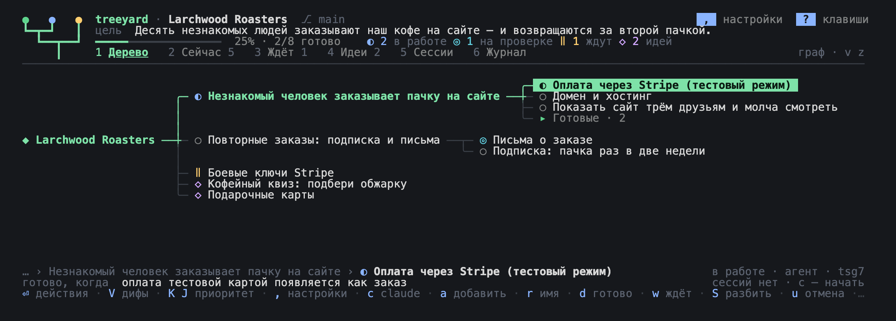
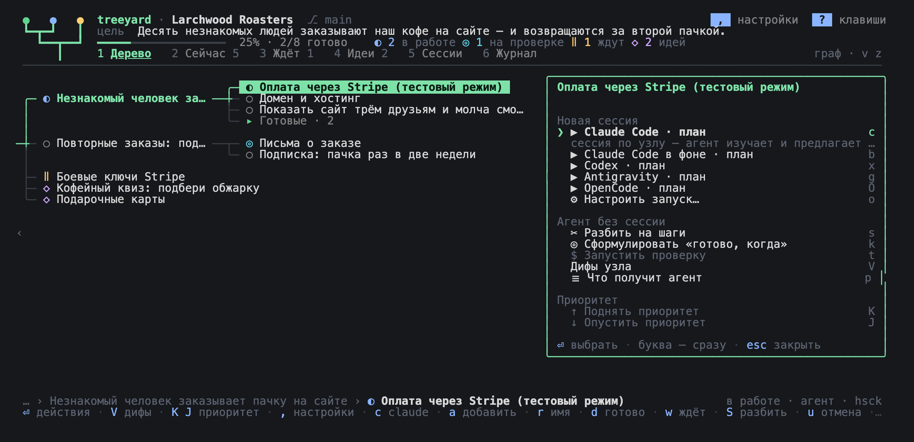

<div align="center">


**Дерево целей для разработки с агентами (Agent-Driven Development) прямо в терминале.**

Проект раскладывается в дерево целей, и у каждого узла есть понятный критерий «готово,
когда». Из любого узла можно открыть сессию Claude Code, Codex, Antigravity или OpenCode,
а агент сам запишет результат обратно в дерево. Так проект доходит до работы в реальной
жизни, а не застревает на «код готов».

[](https://www.npmjs.com/package/@antondanv/treeyard)

[](LICENSE)

[English](README.md) · **Русский**

<!-- Здесь будет промо-ролик (узел kfg8): та же ссылка, что в README.md. -->



</div>

## Зачем я это сделал

Treeyard вырос из моего собственного опыта вайбкодинга. С агентами код пишется очень
быстро, но потом проект почти всегда встаёт. Обычно он упирается в то, что может сделать
только человек: арендовать сервер, купить домен, подключить оплату, показать продукт живым
людям. Пока до этого не доходят руки, агенты пилят побочные фичи, план разрастается в
журнал на тысячи строк, а каждая новая сессия начинает с того, что перечитывает его
целиком. В итоге код готов, а проект стоит.

В Treeyard я собрал практики, которые помогли моим проектам пройти эту точку. Работу
делают агенты, а дерево помнит, ради чего она делается и когда её можно считать
законченной. Это я и называю Agent-Driven Development. Так я веду все свои проекты,
включая сам Treeyard.

## Что это даёт

- **В корне — цель, которую видно в жизни.** Не «сделать MVP», а, например, «десять
  незнакомых людей заказали наш кофе на сайте и вернулись за второй пачкой». Тесты
  показывают, что код работает, а цель — что проект действительно сделал своё дело.
- **У каждого узла есть критерий «готово, когда».** Это одно предложение о том, что можно
  увидеть или запустить: команда, сценарий, скриншот, число. Если такое предложение не
  складывается, значит, задача ещё не понята.
- **Один узел — одна сессия.** Агент получает ровно то, что ему нужно: зачем существует
  узел (путь от корня), когда он будет готов, что находится рядом и какие в проекте
  правила. Читать весь план ему не приходится.
- **«Ждёт» — это статус, а не тупик.** Если ветка упёрлась во что-то внешнее, ей ставят
  «ждёт» с причиной и условием, когда к ней вернуться, а работа продолжается в других
  ветках. Вкладка «Сейчас» собирает всё, за что можно взяться прямо сейчас.
- **Твои собственные шаги тоже в дереве.** Задачи, которые может сделать только человек,
  помечены «делает: ты», поэтому они не всплывают внезапно в самом конце.
- **Агент не закрывает задачу сам.** Он отправляет узел на проверку и показывает
  доказательства: команду и её вывод, скриншот, свои коммиты. Решение «готово» принимаешь
  ты.
- **Новая идея становится новым узлом, а не делается «заодно».** История работы хранится в
  журнале узла, план — в дереве, а важные решения записаны в одном месте вместе с
  причинами.
- **Несколько агентов работают бок о бок.** Claude Code, Codex, Antigravity и OpenCode
  открываются в панелях tmux рядом с деревом. Простаивающие сессии засыпают и освобождают
  память, но каждая остаётся привязанной к своему узлу, так что к ней всегда можно
  вернуться.

### В цифрах

- **Чтобы начать работу, агенту нужно примерно на 95% меньше токенов.** Сессия из узла
  стартует с контекстом около трёх тысяч токенов: от 2,6k до 4,0k, медиана 3,0k по семи
  узлам дерева этого репозитория. Если вместо этого отдать агенту весь план — все узлы с
  описаниями и журналами, — получится 65 тысяч токенов на том же дереве из 105 узлов, а
  вместе с `docs/` и README — 84 тысячи. Контекст узла меньше на 95–96%. Даже обзор всего
  дерева на одной странице (`treeyard show`, 5,5k) почти вдвое больше.
- **Экономия растёт вместе с деревом.** На свежем дереве из 12 узлов весь план (1,0k) ещё
  меньше контекста одного узла (1,7k), так что экономить пока нечего. К тому же основная
  часть токенов в сессии уходит на работу с кодом, а не на её старт.
- **Treeyard собран с помощью самого себя.** Он ведётся своим деревом с первого коммита:
  за пять дней — 108 коммитов, 41 узел готов и ещё 18 на проверке, 35 сессий агентов
  открыто из узлов (со 2 по 6 октября 2026 года).

<sub>Как считали токены (6 октября 2026 года): контекст узла выгружали командой `treeyard
context <id>` в файл и считали через `claude -p "/context" --system-prompt-file <файл>`,
то есть токенизатором самого Claude. Результат сверили с настоящим запросом: 3 387 токенов
против «3.4k». У Codex и Gemini свои токенизаторы, и числа у них будут другими.</sub>

## Когда стоит пользоваться, а когда нет

**Treeyard пригодится, если**

- проект живёт дольше одной сессии — дни, недели, месяцы;
- направлений работы несколько, и часть из них ждёт чего-то извне;
- часть работы можешь сделать только ты сам: сервер, домен, оплата, договор, показ живым
  людям;
- параллельно работают несколько агентов или разные CLI, и хочется видеть, кто чем занят;
- у тебя несколько проектов, и ты возвращаешься к одному из них после перерыва: дерево и
  журналы напомнят, на чём ты остановился.

**Лучше обойтись без него, если**

- задача одна и небольшая: написать скрипт, поправить баг, что-то выяснить. Проще открыть
  обычный `claude` или `codex` — на посадку дерева, критерии и статусы уйдёт больше
  времени, чем на саму задачу;
- это прототип на один вечер, который потом выбросят;
- команда уже живёт в своём трекере. Treeyard рассчитан на одного человека с агентами,
  хотя синхронизироваться с доской GitHub Project он умеет.

Сам Treeyard код не пишет — это делают твои агенты. Его задача — помнить, над чем они
работают и когда работа считается сделанной.

## Быстрый старт

Понадобится Node.js 22 или новее и хотя бы один CLI агента: Claude Code, Codex,
Antigravity или OpenCode. Чтобы сессии открывались в панелях рядом с деревом, нужен ещё
tmux (на macOS — `brew install tmux`). Основная платформа — macOS.

```sh
npm install -g @antondanv/treeyard
treeyard config lang ru                    # интерфейс, шаблоны и тексты для агентов — на русском
cd my-project && treeyard                  # если дерева ещё нет, откроется мастер посадки
```

По умолчанию интерфейс на английском, а команда `treeyard config lang ru` переключает его
на русский. Посадка дерева вместе с агентом занимает минут двадцать. Начать можно и
по-другому:

```sh
treeyard init                              # новое дерево: с агентом или по шаблону
treeyard init --agent --brain codex        # сразу с агентом, без мастера
treeyard import                            # агент сам прочитает план проекта и построит дерево
```

## Как с ним работать

1. Открой вкладку **«Сейчас»** (`2`): там всё, за что можно взяться прямо сейчас, по всем
   веткам. Выбери узел.
2. Нажми `c`, и рядом с деревом откроется сессия Claude Code по этому узлу. `⏎` открывает
   меню со всеми действиями, в том числе с запуском других агентов.
3. Агент получает контекст узла, изучает код и предлагает план. Ты его одобряешь, и агент
   берётся за работу.
4. Когда критерий выполнен, агент отправляет узел **на проверку** и прикладывает
   доказательства: команду с выводом, скриншот, свои коммиты (их можно посмотреть по `V`).
   Ты проверяешь и нажимаешь `d` — узел **готов**.
5. Если работа упёрлась во что-то внешнее, нажми `w`: узел перейдёт в **«ждёт»** с
   причиной и условием возврата, а ты займёшься другой веткой.
6. Если по ходу появилась идея, добавь её клавишей `a` со статусом «идея». Раз в неделю
   загляни во вкладку **«Ждёт»** (`3`) и проверь, не пора ли к чему-то вернуться.

## Посадка дерева с агентом

Если в папке ещё нет дерева, `treeyard` откроет мастер на весь экран. Дерево можно сажать
**с агентом** (Claude Code, Codex, Antigravity или OpenCode) или **самому, по шаблону**.

Агент получает скилл [`treeyard-init`](skills/treeyard-init/SKILL.md) и действует по
шагам:

1. **Разбирается, с чем имеет дело.** В пустой папке он попросит рассказать о проекте всё,
   что ты о нём думаешь, сплошным текстом. В существующем проекте изучит код, документы и
   историю коммитов и коротко расскажет, что на самом деле работает, что было обещано, но
   не сделано, и где остались хвосты.
2. **Задаёт вопросы.** По одному–три за раз, и к каждому сразу предлагает свой вариант
   ответа, так что часто достаточно сказать «да». Всего вопросов не больше двенадцати, и
   только о том, что влияет на форму дерева. О том, что видно из репозитория, он не
   спрашивает. Мелочи вроде языка README сразу становятся узлами в наброске.
3. **Договаривается о цели и первой вехе — именно в таком порядке.**
   - В корень дерева идёт большая цель: ради чего проект вообще существует («десять
     незнакомых людей заказали наш кофе на сайте и вернулись за второй пачкой»), а не
     «сделать MVP».
   - Первая ветка — это первая веха, то есть ближайшая проверка в реальной жизни
     («незнакомый человек заказывает пачку на сайте»).
   - Ещё агент спросит, сколько времени ты готов вложить до этой вехи.
4. **Спрашивает о шагах в реальном мире, а не в коде.** Сервер, домен, оплата, договор,
   живой пользователь — всё это сразу попадает в дерево узлами «делает: ты», а не копится
   под конец, где проекты обычно и вставали.
5. **Показывает набросок дерева текстом.** Сначала идёт самый короткий путь от начала до
   работающего результата, у каждого узла есть критерий «готово, когда», всё
   заблокированное помечено «ждёт», а идеи вынесены в отдельную ветку. Сажает дерево агент
   одной командой (`treeyard import --from-json -`), но только после твоего «да».
6. **Пишет несколько коротких документов вместо прежнего десятка.** Это `docs/vision.md`,
   `AGENTS.md` как единственный источник правил и `CLAUDE.md` из одной строки
   `@AGENTS.md`. План и задачи с этого момента живут в дереве.

Если установлен tmux, разговор с агентом открывается справа, а слева по мере посадки
появляется и растёт дерево. Всё, что ты печатаешь, сразу уходит агенту. `⌃Q` возвращает
управление дереву, `f` — снова разговору, а `F` разворачивает разговор на весь экран.
Когда посадка закончится, ничего дополнительно запускать не нужно.

Без tmux (или с настройкой `open=terminal`) агент работает на весь экран прямо в этом
терминале. Когда ты выйдешь из сессии, откроется дерево.

Чтобы тот же скилл знали обычные `claude`, `codex` и `agy` в любой папке, его можно
установить отдельно:

```sh
treeyard skills            # где лежит скилл и куда он уже установлен
treeyard skills install    # ~/.claude/skills, ~/.codex/skills, ~/.gemini/config/skills
```

## Как это выглядит

- **Граф** — вид по умолчанию. Цель находится слева, ветки растут вправо, а каждый
  родитель стоит посередине между своими детьми. Узел занимает одну строку, поэтому всё
  рабочее дерево помещается на экране. Дети начинаются сразу за названием родителя, а
  листья занимают оставшееся место справа: короткая группа «Готовые · N» не отодвигает
  соседей, и длинные названия обрезаются реже.

  Выбранный узел подсвечен зелёной «таблеткой», путь к нему от корня тоже выделен. Если
  название не помещается целиком, оно медленно прокручивается до конца и обратно,
  ненадолго замирая на краях. Клавиша `z` показывает те же узлы карточками, а `v` —
  деревом с отступами, как список.

  Когда открыта сессия, ширина карточек подстраивается под оставшееся слева место, а граф
  и карточки сдвигаются к ветке, в которой идёт работа. Корень при этом уходит левее;
  вернуться к нему можно через `⌥←` или перейдя на верхнюю ветку. В узком списке длинные
  отступы сокращаются до `…`, но статус и название узла видны всегда.

  Подписи агентов становятся компактными: `⠋ claude` — агент работает, `? claude` — ждёт
  твоего ответа, `▣ codex` — у агента открыта панель. Их видно и на выбранном узле, чуть в
  стороне от подсвеченного названия.
- **Полоса внизу** показывает, где ты находишься, что значит «готово» для выбранного узла
  (или чего он ждёт) и что с его сессиями: агент работает, ждёт тебя или сессий нет. В
  первую очередь место отдаётся названию и статусу выбранного узла, а если весь путь не
  помещается, промежуточные шаги сокращаются до `…`.
- **Вкладки:** `1` «Дерево»; `2` «Сейчас» — всё, за что можно взяться прямо сейчас, по
  всем веткам; `3` «Ждёт» — заблокированные ветки с причиной и условием возврата; `4`
  «Идеи»; `5` «Сессии» — сессии этой папки, сгруппированные по Claude Code, Codex,
  Antigravity и OpenCode (группы переключаются стрелками `← →`); `6` «Журнал» — всё, что
  происходило в дереве.



На корне дерева клавиша `c` запускает ревью всего дерева агентом проекта, а `⏎` открывает
меню, где кроме ревью есть разговор о проекте. В пункте «⚙ Другой агент, место, модель…»
(`o`) можно выбрать Claude Code, Codex, Antigravity или OpenCode, а также где открыть
сессию — в панели или в терминале; Claude может работать ещё и в фоне. Агент получает
цель, обзор узлов, содержимое вкладок «Сейчас» и «Ждёт», последние записи журналов,
правила и решения проекта. Во время ревью он сначала показывает находки и команды
`treeyard`, а меняет что-то только после твоего согласия. В разговоре первым пишешь ты:
можно спросить о состоянии проекта, завести новые узлы или закрыть старые. Сессии проекта
хранятся в `.tree/tree.md`: они видны в меню корня и во вкладке «Сессии» с пометкой `◆`.
Клавиша `f` продолжает такую сессию в панели, а `x` её усыпляет.

## Клавиши

Буквенные команды работают и в русской раскладке — на тех же физических клавишах: `р о л
д` срабатывают как `h j k l`, `ф` — как `a`, `Ф` — как `A`. Это действует в дереве,
списках, меню и диалогах, а Shift сохраняет своё значение. В поиске, формах и панелях
агентов русский текст набирается как обычно.

| | |
| --- | --- |
| `↑ ↓` `← →` | вверх и вниз по колонке графа · к родителю и к детям (`j k` — по всем узлам подряд); с верхнего уровня `←` ведёт к корню `◆` |
| `space` `+` `−` | свернуть или раскрыть ветку · раскрыть всё · свернуть всё |
| `:` или `⌃K` | палитра: найти любой узел или действие по словам |
| `/` | отфильтровать дерево по названию |
| `⏎` | всё про узел: продолжить сессию, начать новую, дать задачу агенту без сессии, запустить проверку |
| `c` `b` | сессия Claude Code по узлу (в панели, если есть tmux) · то же в фоне |
| `f` `F` `x` `p` | сессия справа: печатать в неё · развернуть на весь экран · усыпить · скрыть (подробнее ниже) |
| `a` `A` | новый узел внутри выбранного · рядом с ним; название вводится в строке внизу, длинный текст переносится и виден целиком (`tab` — сразу с критерием) |
| `r` `e` `E` | переименовать · изменить поля и описание · открыть узел во внешнем редакторе |
| `d` `w` `s` | отметить готовым (на готовом узле — вернуть «к работе») · поставить «ждёт» с причиной · выбрать любой статус |
| `D` `y` | удалить узел · скопировать его id |
| `G` | GitHub: подключить доску (откроется мастер) или синхронизироваться с уже подключённой |
| `I` | картинки узла: скриншот из буфера (`v`), подпись (`n`), просмотр на весь экран (`o` — в полном размере в Preview), удаление (`D`); файл картинки можно просто перетащить в окно |
| `V` | дифы узла: привязанные коммиты → файлы → цветной диф; то же есть в меню `⏎` и в палитре `:` |
| `P` | документы проекта: все `.md` с разметкой, их можно читать и править во встроенном редакторе; на корне `◆` то же открывает `⏎` |
| `S` | агент разбивает узел на 3–7 шагов, а ты отмечаешь, какие из них добавить (каким агентом разбивать, выбирается при подтверждении) |
| `t` | запустить проверку узла — команду из поля «проверка» |
| `u` | отменить последнее изменение |
| `tab` `⇧tab` | вложить узел · поднять его на уровень выше |
| `K` `J` или `⇧↑` `⇧↓` | поднять или опустить приоритет среди соседей с тем же статусом (это есть и в меню `⏎`, и в палитре `:`) |
| `⌥` + стрелки | сдвинуть граф · `f` возвращает к выбранному узлу |
| `v` `z` `i` `.` | граф или список · строки или карточки · панель деталей · показать или скрыть готовое |
| `,` `⌃R` | настройки · перечитать дерево с диска |
| `?` `q` | все клавиши (если не помещаются, листай `↑↓` `PgUp` `PgDn`) · выход |

В окне «Изменить узел» (`e`) есть многострочное поле «Описание». В нём `Enter` начинает
новую строку, `↑↓` перемещают курсор между строками, а `←→` — по тексту. При вставке
переносы строк сохраняются, длинный текст переносится по ширине окна, а видимая часть
следует за курсором. `Tab` и `Shift+Tab` переключают поля, `Ctrl+S` сохраняет всё окно
сразу; в остальных полях сохранить можно и клавишей `Enter`. `Esc` отменяет правки, а `u`
в дереве отменяет уже сохранённое изменение. Журнал сохраняется отдельно от описания. Если
нужно отредактировать весь Markdown-файл узла вместе с журналом, для этого по-прежнему
есть `E`.

Внутри каждого родителя узлы сгруппированы по статусу. По умолчанию порядок такой: **в
работе → на проверке → к работе → ждёт → идея → готово → отказ**. Внутри одного статуса
порядок ты задаёшь сам, сверху вниз. Он хранится в поле `order` у узлов, виден в CLI и в
`.tree/README.md`, а перестановку можно отменить клавишей `u`. Когда у узла меняется
статус, он сам переезжает в нужную группу. Порядок статусов настраивается в пункте
«Порядок статусов» в настройках (`,`) или командой `treeyard config status_order`:

| Вариант | Сверху вниз |
| --- | --- |
| `active-first` — в работе сверху (по умолчанию) | в работе → на проверке → к работе → ждёт → идея → готово → отказ |
| `done-first` — готовые сверху | готово → в работе → на проверке → к работе → ждёт → идея → отказ |
| `active-last` — в работе снизу | идея → ждёт → к работе → на проверке → в работе → готово → отказ |
| `custom` — свой порядок | как расставишь сам: `⏎` на строке «Порядок статусов» открывает список статусов, `K` `J` или `⇧↑` `⇧↓` двигают их, `⏎` сохраняет |

Узлы, которые ты подтвердил как готовые, собираются в свёрнутую группу **«Готовые · N»** —
в конце ветки или там, где «готово» стоит в выбранном порядке. Чтобы раскрыть группу,
выбери её и нажми `space` (или `⏎`); повторный `space` свернёт её обратно. Клавиша `+`
тоже раскрывает такие группы. Узлы «на проверке» в группу не попадают и всегда остаются на
виду. Поиск `/` и палитра `:` находят и готовые узлы, а внутри группы у них доступны те же
сессии и действия. Группа влияет только на отображение: родители, история и файлы узлов
остаются прежними.

### Мышью

| | |
| --- | --- |
| клик | выбирает узел в графе или в списке (в том числе корень `◆`), строку во вкладках «Сейчас», «Ждёт», «Идеи», «Журнал» и «Сессии» · переключает вкладки |
| двойной клик | то же, что `⏎`: действия узла, открытие сессии, переход к узлу из журнала; в меню — выбор пункта |
| клик по `▸` `▾` или `›4` | раскрывает или сворачивает ветку в списке · в графе раскрывает свёрнутую ветку и переходит в неё |
| клик по подсказке | нажимает её клавишу: это работает для подсказок внизу экрана, `,` и `?` в шапке, кнопок панели сессии и подвалов диалогов |

Клик по подсказке в точности повторяет нажатие её клавиши, поэтому мышью можно сделать всё
то же, что и с клавиатуры. Пока открыт диалог, дерево слева на клики не реагирует.

## Подтверждение и настройки

Перед каждой сессией и каждой задачей агента treeyard уточняет детали: какой узел, кто
будет работать (Claude Code, Codex, Antigravity или OpenCode), где (в панели, в этом
терминале или в фоне), как начать и на какой модели. Здесь же видно первое сообщение,
которое получит агент. `⏎` запускает, `o` позволяет поменять параметры, `esc` отменяет
запуск, а `!` отключает эти вопросы. Команда `treeyard open` из shell спрашивает так же, а
с флагом `--yes` запускает без вопросов.

Claude Code, Codex и OpenCode берут права доступа из своих собственных настроек (у
OpenCode это `permission` в `opencode.json`). У Antigravity там есть только режимы plan и
accept-edits, и он спрашивает разрешения перед каждой командой. Поэтому treeyard запускает
и возобновляет его с полным доступом (`--dangerously-skip-permissions`).

Режим «План» запускает Claude Code в его режиме plan, а OpenCode — с его агентом plan:
пока ты не согласишься с планом, править файлы агент не может. Claude Code с готовым
планом сам спросит, можно ли приступать. OpenCode спросит так же или попросит переключить
агента: `Tab` в его панели включает агента build. Codex и Antigravity получают ту же
просьбу обычными словами.

Перед командами «Разбить на шаги» и «Сформулировать «готово, когда»» подтверждение
выглядит как небольшая форма. Мозг (Claude Code, Codex, Antigravity или OpenCode), модель
и уровень усилия выбираются стрелками `←→`, а между полями можно переходить по `↑↓`.
Изначально там стоят мозг проекта и модель из `assist_model`. Если выбрать что-то другое,
это подействует только на текущую задачу, а настройки проекта не изменятся. Если у модели
нет выбранного уровня усилия (у Haiku его нет вовсе), агенту он не передаётся.

Настройки открываются клавишей `,` (она всегда подписана в правом верхнем углу) или
командой `treeyard config`:

| Для всех проектов (`~/.treeyard/settings.json`) | |
| --- | --- |
| `lang` | `en` (по умолчанию) или `ru` — язык интерфейса, шаблонов и текстов для агентов |
| `confirm` | спрашивать ли подтверждение перед запуском сессий и задач агента |
| `theme` | `dark` или `light` — под цвет твоего терминала |
| `animation` | спиннеры и мигающий лист |
| `marquee` | бегущая строка: длинное название выбранного узла прокручивается, чтобы его можно было прочитать целиком |
| `status_order` | порядок статусов внутри каждого родителя: `active-first` (по умолчанию), `done-first`, `active-last`, `custom` или свой — все семь статусов через запятую |
| `live` | живые статусы сессий Claude Code, Codex, Antigravity и OpenCode: кто сейчас работает, а кто ждёт тебя |
| `open` | где открывать сессии: в панели (`pane`, по умолчанию) или в терминале (`terminal`); без tmux они всегда открываются в терминале |
| `sleep_after` | через сколько минут простоя усыплять сессию: 15, 30 или 60 (по умолчанию 30); `0` — никогда |
| `max_panes` | сколько живых панелей может быть у проекта: 3, 5 или 8 (по умолчанию 5); `0` — без ограничения |
| `notes` | папка с деревом, куда `treeyard note` складывает замечания из любого проекта; `off` — не собирать. В настройках (`,`) это пункт «Куда падают замечания»: путь (`~`, `.` — этот проект) или пустое значение, чтобы отключить |

Когда `live` включён, у узла с работающим Codex крутится спиннер, а сама сессия
учитывается в счётчике «работает агентов» вверху, даже если она длинная. Если агент в
панели задал вопрос или запросил разрешение, узел покажет «ждёт тебя»; после ответа или
отмены пометка исчезнет при следующем обновлении. Статусы обновляются каждые 3 секунды.
Счётчик вверху учитывает только сессии, привязанные к узлам этого дерева.

У OpenCode пока бывает только статус «работает»: Brainyard не отличает его вопрос или
запрос разрешения от работы, поэтому «ждёт тебя» у него не появляется.

| Этот проект (`.tree/tree.md`) | |
| --- | --- |
| `brain` | мозг по умолчанию: claude, codex, antigravity или opencode |
| `start` | как начинать сессию: plan, do, goal или chat |
| `model`, `effort` | модель и уровень усилия для сессий — выбираются из списка, который отдаёт сам CLI |
| `assist_model` | модель для разбивки на шаги и формулировки критерия; можно взять подешевле |

Вписывать модели вручную не нужно: treeyard сам спрашивает их у CLI (`codex debug models`,
`agy models`, `opencode models` — последняя показывает модели провайдеров, подключённых к
OpenCode). Для Claude Code используются псевдонимы fable, opus, sonnet и haiku, которые
всегда указывают на последнюю версию. Уровни усилия предлагаются только те, которые
понимает выбранная модель, а звёздочкой `*` отмечен её уровень по умолчанию. Модель и
усилие привязаны к мозгу проекта и сбрасываются, когда мозг меняется. Те же списки есть и
в окне запуска (`o`). Сессии OpenCode усилие при запуске не передаётся: OpenCode меняет
его (это вариант модели) прямо внутри сессии по `ctrl+t`. А вот разбивка на шаги и
формулировка критерия передают усилие и в OpenCode.

```sh
treeyard config                 # показать все настройки
treeyard config lang ru         # русский язык
treeyard config confirm off     # запускать без подтверждения
treeyard config sleep_after 15  # усыплять после 15 минут простоя
treeyard config max_panes 3     # не больше трёх панелей; работающие и видимые не трогаются
treeyard config status_order done-first  # готовые сверху
treeyard config status_order todo,review,active,waiting,idea,done,dropped  # свой порядок
treeyard config notes ~/Projects/my-notes  # куда складывать замечания
TREEYARD_LANG=ru treeyard       # язык только на этот запуск
```

## Сессии рядом с деревом

Сессия, открытая «в панели», живёт в tmux. Её экран виден справа от дерева, печатать в неё
можно, не выходя из treeyard, а если закрыть treeyard, сессия продолжит работать: при
следующем запуске она снова окажется в своём узле. Так работают все четыре CLI.

| | |
| --- | --- |
| `f` или клик по панели | печатать в сессию: в CLI уходит всё, включая стрелки, вставку и `⌃C` |
| `⌃Q` или клик по дереву | вернуться к дереву |
| `F` | развернуть сессию на весь экран; `⌃Q` возвращает к дереву |
| `x` | усыпить сессию: CLI закрывается и освобождает память, а разговор остаётся в его истории |
| `f` на узле со спящей сессией | разбудить её: тот же разговор откроется в новой панели (после подтверждения) |
| `p` | скрыть или показать панель |
| `⇧←` `⇧→` или `<` `>` | сделать панель шире или уже, граница двигается в сторону стрелки; то же делает клик по `⇧← ⇧→` в правом углу панели |
| колесо · `PgUp` `PgDn` · `End` | история панели · листать по страницам · вернуться к живому экрану |
| протянуть мышью по экрану панели | выделить текст и скопировать его в буфер обмена (мышь занята Treeyard, поэтому выделяет он сам) |

В правом верхнем углу видно, сколько сессий сейчас живо и сколько памяти они занимают.
Примерно это так: Claude Code — 200–300 МБ, Codex — около 80, Antigravity — около 350,
OpenCode — 0,5–1 ГБ.

Treeyard читает экран только той сессии, которая у тебя перед глазами, остальные он не
трогает. Тихие сессии засыпают сами (`sleep_after`, по умолчанию через 30 минут простоя).
А если живых сессий становится больше, чем `max_panes` (по умолчанию 5), засыпает та, что
простаивает дольше всех. Сессия, которая работает, ждёт тебя или открыта на экране, не
засыпает никогда. OpenCode пока сам не засыпает совсем, потому что Brainyard не может
определить, что он свободен; усыпить его можно клавишей `x`. Сессия, в которой не было ни
одного сообщения, не засыпает, а просто закрывается: CLI не сохраняет пустой разговор, и
будить было бы нечего.

Во вкладке «Сессии» (`5`) можно выбрать любую сессию и нажать `x` — уснёт именно она, даже
если её панель скрыта или она запущена в фоне через `b`. Фоновые сессии Claude Code
останавливаются его собственной командой `stop`, при этом разговор и привязка к узлу
сохраняются. В списке у такой сессии появится `☾ спит`, а `⏎` продолжит тот же разговор.
Если усыпить сессию вручную, она остановится, даже если в этот момент работает. Сессию,
открытую на весь экран или в другом терминале, сначала нужно закрыть там.

Сессии этой папки, которые не привязаны ни к одному узлу, помечены `без узла`: их открыли
в обход дерева. Над списком указано, сколько всего сессий было за последние 14 дней и
сколько из них прошли мимо дерева; та же сводка выводится в конце `treeyard sessions`.
Привязать такую сессию к узлу можно клавишей `l`.

Для панелей нужен tmux: `brew install tmux`. У treeyard свой сервер tmux (`tmux -L
brainyard`), поэтому твой собственный tmux и его настройки он не трогает.

## Агенты и дерево

Сессия, открытая из узла, получает короткий контекст: путь от корня (то есть зачем этот
узел нужен), критерий готовности, соседние узлы, правила проекта и команды для работы с
деревом. Агенты пишут в дерево теми же командами, что и человек:

```sh
treeyard show                                   # всё дерево; treeyard show <id> — один узел
treeyard add "Показать продукт человеку" --who human --parent <id>
treeyard set <id> status=waiting waiting="нет сервера" until="появится VPS"
treeyard set <id> status=review                 # агент отправляет на проверку; «готово» ставит человек
treeyard log <id> "что сделано; что осталось"
treeyard note "справка не помещается в экран"   # замечание о самом treeyard — в «Замечания»
treeyard image <id> shot.png --note "…"         # приложить к узлу картинку (скриншот, доказательство)
treeyard diff <id> --add <sha>                  # привязать свой коммит к узлу, чтобы его проверили
treeyard add "Codex: статус хода" --project ../api --for <id>   # нужна правка в другом проекте
treeyard open root --start plan --pane          # ревью дерева в панели
treeyard open root --start chat --brain codex   # разговор о проекте
treeyard open <id> --brain codex                # сессия по узлу прямо из shell
treeyard open <id> --brain codex --pane         # открыть панель и вернуться в shell
treeyard open <id> --brain opencode --pane      # то же с OpenCode
treeyard sessions                               # сессии папки во всех CLI; «без узла» — открытые мимо дерева
treeyard context <id>                           # ровно то, что получит агент
treeyard pointer                                # добавить блок о дереве в AGENTS.md / CLAUDE.md
```

Отмена (`u`) возвращает только твои собственные изменения: если агент успел поправить тот
же узел, его правка останется.

### Корень и документы проекта

На корень `◆ <проект>` тоже можно встать: клавишей `←` с ветки верхнего уровня, кликом или
клавишей `↑` с первой строки списка. У корня есть своя карточка (`i`) с целью, прогрессом,
документами проекта и описанием того, как ведётся дерево. `⏎` на корне открывает меню
проекта: документы, «Цель, правила и решения» (`.tree/tree.md`), настройки и создание
новой ветки.

Клавиша `P` (в русской раскладке — `З`) из любого места открывает «Документы проекта». Там
собраны все `.md` из Git — и отслеживаемые, и новые, кроме игнорируемых файлов и узлов
дерева; если Git нет, показываются файлы папки. Первым идёт `.tree/tree.md`, за ним
README, AGENTS и CLAUDE. `⏎` открывает документ для чтения: заголовки, списки, цитаты, код
и ссылки выделены цветом, а листать можно `↑↓`, `PgUp/PgDn` и `Home/End`. Клавиша `e`
открывает встроенный редактор на том же месте, где ты читал:

| | |
| --- | --- |
| стрелки · `PgUp` `PgDn` · `Home` `End` | курсор · по страницам · в начало и конец строки (`⌃Home` `⌃End` — всего текста) |
| `⌥← ⌥→` · `⌃A` `⌃E` | по словам · в начало и конец строки |
| `⌃W` · `⌃K` · `⌃U` | удалить слово · до конца строки · до начала строки |
| `⌃S` · `⌃Z` | сохранить · отменить последнюю правку (по словам) |
| `esc` | выйти; если есть несохранённые правки, `s` сохраняет их, `d` выбрасывает, а `esc` оставляет тебя в редакторе |

Если файл изменился на диске, пока был открыт (его поправил агент или другой редактор),
`⌃S` не затрёт чужую правку молча: `o` перезапишет файл, а `r` перечитает его с диска.
Если YAML-шапка у `tree.md` не читается, сохранить его не получится. Правку `tree.md`
можно отменить клавишей `u` в дереве, как и любую другую правку дерева.

### Дифы узла

Коммиты, привязанные к выбранному узлу, открываются клавишей `V` (в русской раскладке —
`М`), через `⏎` → «Дифы узла» или из палитры `:`. Клавиша `a` позволяет выбрать коммит из
истории Git, а `n` в списке коммитов подгружает ещё 100. Агент после коммита сам
привязывает его командой `treeyard diff <id> --add <sha>` — эта команда есть в контексте
узла. Привязки хранятся в поле `commits` файла узла и коммитятся вместе с деревом.
Привязывать стоит только коммиты с работой по этому узлу: при просмотре показывается весь
коммит целиком.

`↑↓` выбирают коммит или файл, `Enter` или `→` открывают его. Рядом с кодом в дифе видны
номера строк до и после изменения. Добавленное выделено зелёным, удалённое — красным, а
изменённые слова подсвечены ярче. Длинные строки переносятся с отметкой `↪` и сохраняют
отступ. Служебные заголовки Git скрыты, а блоки изменений разделены диапазонами строк.
Статистика `+`/`−` в списке файлов тоже цветная. Текст прокручивается `↑↓`, `PgUp/PgDn` и
`Home/End`. `Esc` или `←` возвращают к списку файлов, затем к коммитам и в дерево, а `r`
заново читает Git. Строку можно выбрать мышью и открыть двойным кликом. `D` в списке
привязанных коммитов снимает привязку, а `u` после возврата в дерево отменяет и привязку,
и её снятие. Сам коммит в Git при этом никуда не девается.

Отдельный пункт — «Текущие изменения проекта»: файлы в индексе, правки в рабочей папке и
новые файлы, которые не игнорируются. Они общие для всех узлов репозитория. Каждый
привязанный коммит показывается отдельно, относительно своего родителя (у merge-коммита —
первого), поэтому промежуточные коммиты других узлов в его диф не попадают. Для бинарных
файлов вместо содержимого показывается пометка Git. Просмотр ничего не меняет: ни файлы,
ни индекс, ни историю Git.

```sh
treeyard diff <id>                              # дифы всех коммитов узла
treeyard diff <id> --add <sha>                  # полный SHA или однозначное сокращение
treeyard diff <id> --add <sha1> --add <sha2>    # сразу несколько коммитов
treeyard diff <id> --rm <sha>                   # снять привязку, даже если коммита уже нет
treeyard diff <id> --commit <sha> --file src/app.ts
treeyard diff <id> --stat                       # только файлы и +/−, без текста дифа
treeyard diff <id> --working                    # текущие изменения проекта, общие для всех узлов
treeyard diff <id> --json                       # коммиты, файлы и дифы для скрипта
treeyard diff <id> --project ../X --add <sha>   # привязать к дереву другой папки или основного worktree
```

### Замечания

Если treeyard в чём-то мешает или чего-то не хватает, это можно записать одной строкой, не
отрываясь от работы и из любой папки: `treeyard note "…"`. Замечание станет идеей в ветке
«Замечания» того дерева, которое указано в настройке `notes`; если такой ветки ещё нет,
она появится сама. Указать дерево можно в настройках (`,` → «Куда падают замечания») или
командой `treeyard config notes <папка>`. В описании замечания записано, откуда оно
пришло, например: `Откуда: my-app › «Закрыть один узел» (k3f9)`. Узел известен, если
команда запущена из сессии, открытой из узла: treeyard передаёт такой сессии
`TREEYARD_NODE=<id>`, а более старые сессии Claude Code узнаёт по их id. Из обычного shell
записывается только проект, но узел можно указать вручную: `--node <id>`. Когда `notes`
задан, агент в сессии из узла тоже знает про `treeyard note`: эта команда есть в его
списке команд дерева.

### Картинки узла

Скриншот бага или макет удобнее приложить к узлу, чем описывать словами. Скопируй скриншот
(`⌘⇧⌃4` на Mac), нажми `I` на узле, а затем `v` — картинка из буфера прикрепится. Само по
себе открытие окна ничего не прикрепляет. Файл картинки (PNG, а на Mac ещё JPG, HEIC,
TIFF, GIF, BMP и WebP) можно просто перетащить в окно терминала: терминал вставит путь к
файлу, и картинка прикрепится к выбранному узлу.

В деталях узла (`i`) видны миниатюры с подписями. В окне `I` есть список, превью и подпись
(`n`); `←→` листают картинки, а `o` открывает картинку в полном размере в системном
просмотрщике (на Mac — в Preview). Картинки рисуются цветными символами `▀`, поэтому нужен
терминал с поддержкой truecolor. Apple Terminal так рисовать не умеет, и превью в нём
выглядит мозаикой, поэтому там `⏎` сразу открывает картинку в Preview.

Картинки хранятся в `.tree/.local/images/<id>/` — рядом с деревом, но не в git. Когда узел
становится «готово» или «отказ», его картинки хранятся ещё неделю (если отменить изменение
клавишей `u`, узел вернётся вместе с ними), а потом удаляются. Картинки удалённого узла
тоже удаляются через неделю.

Сессия из узла получает в контексте пути к картинкам и их подписи, и агент открывает их
сам. Агент может и сам приложить скриншот — например, как доказательство для проверки:

```sh
treeyard image <id> shot.png --note "кнопка на месте"   # приложить; --paste — из буфера
treeyard image <id>                                      # пути и подписи
treeyard image <id> 001.png --note "…" · --rm 001.png    # подписать · удалить
```

### Совместные узлы

Если узлу нужна правка в другом проекте, агент не лезет туда молча, а заводит узел в
дереве того проекта: `treeyard add "…" --project ../api --for <id>`. Узел попадёт в ветку
«Совместные узлы» того дерева (если её нет, она появится; другую ветку можно указать через
`--parent`), а в его описании будет сказано, откуда он пришёл. Оба узла связаны между
собой: у твоего появится `needs: [../api#hv95]`, у того — `for: [../my-app#g9ph]`; пути
указываются от папки проекта. В журналы обоих узлов записывается строка о связи.

Выглядит это так: в карточке и под графом видно «ждёт: ○ api › … · к работе» и «нужен для:
my-app › …», а в строке дерева — `→ api ○`. Если папку или узел найти не удалось, вместо
этого будет серое «не найдено». Узел в статусе «ждёт», у которого всё необходимое уже
готово, возвращается во вкладку «Сейчас» с пометкой «можно продолжать».

Закрывать совместный узел вручную не нужно. Агент, который сделал там работу, сам ставит
`treeyard set <id> status=done --project ../api` (для таких узлов агенту это разрешено). А
когда человек отмечает готовым свой узел, совместный закрывается автоматически, если он
больше никому не нужен. Связь можно задать и вручную: `treeyard set <id>
needs=../api#y79a` (пустое `needs=` её снимает).

### Доска GitHub Project

Задачи с доски GitHub превращаются в узлы дерева, а статус синхронизируется в обе стороны.
Передвинул карточку на GitHub — у узла поменялся статус; перевёл узел «в работу» или в
«готово» — карточка переехала в нужную колонку.

Пока доска не подключена, в корне дерева стоит узел **GitHub**. Это не файл, а предложение
подключить доску. `⏎` на нём (или `G` из любого места) открывает мастер из трёх шагов:

1. **gh.** Если его нет, мастер предложит `brew install gh`. Если вход не выполнен или нет
   доступа к доскам, команды `gh auth login` и `gh auth refresh -s project` запустятся
   прямо в этом терминале.
2. **Репозиторий** берётся из `git remote`. Он нужен, чтобы понять, чей это аккаунт: доска
   GitHub Project принадлежит не репозиторию, а аккаунту — твоему или организации. Если
   репозитория нет, можно выбрать один из своих (тогда добавится remote) или создать
   новый. Создать его можно самому — с именем папки, приватным или публичным
   (переключается `tab`), без push — или поручить агенту: появятся узел и сессия, и агент
   спросит имя и видимость.
3. **Доска.** Можно подключить одну из досок владельца репозитория или создать новую —
   самому (с колонками по умолчанию) или с помощью агента (он сделает колонки под статусы
   дерева и сам подключит доску). А можно нажать `i` и обойтись без доски, только с issues
   репозитория.

После подключения появляется настоящий узел «GitHub» (`github: hub`), и карточки
складываются внутрь него. `G` на этом узле синхронизирует дерево с доской и issues. Если
узел не нужен, его можно скрыть в настройках: `,` → «Узел GitHub» → скрыть (в `tree.md`
это `github: off`).

То же самое можно сделать из shell:

```sh
treeyard github link owner/1 [--parent <id>]    # или ссылка на доску; без --parent — в узел «GitHub»
treeyard github link owner/app                  # issues репозитория (или ссылка на него), можно вместе с доской
treeyard github sync                            # синхронизация в обе стороны: и доска, и issues
treeyard github                                 # к чему привязано дерево и какие колонки
```

Команда `link` находит на доске поле Status и угадывает, какая колонка соответствует
какому статусу (Todo → «к работе», In Progress → «в работе», Review → «на проверке», Done
→ «готово» и так далее). Результат записывается в `.tree/tree.md` в `github.columns`, и
там его можно поправить. Если у статуса нет своей колонки, карточка с таким статусом
остаётся на месте.

`sync` заводит узлы для карточек, которых ещё нет в дереве (готовые карточки остаются на
доске), и не создаёт дублей: в поле `github.item` у узла записана его карточка. Если с
прошлого раза карточку передвинули на доске, узел получает её статус, а в журнале
появляется запись «github · … карточка в „Done“». Если же поменялся статус узла, карточка
переезжает в нужную колонку. Статус, изменённый в дереве (через `treeyard set`, клавишами
`d` и `w` или при старте сессии), двигает карточку сразу. Если сдвинуть её не получилось,
это записывается в журнал узла, и следующий `sync` доделает работу. Всё идёт через `gh` с
его авторизацией; нужен scope `project` (`gh auth refresh -s project`).

**Issues без доски.** После `link owner/репозиторий` (в `tree.md` это поле `github.repo`)
`sync` заводит узел-идею для каждой открытой issue (pull request'ы не учитываются) и тоже
без дублей: номер issue хранится в `github.issue`. Если issue закрыли на GitHub, узел
становится «готово» (или «отказ», если её закрыли как not planned); если открыли снова, он
возвращается «к работе». Это работает и в обратную сторону: «готово» в дереве сразу
закрывает issue, «отказ» закрывает её как not planned, а возврат в работу открывает
заново. Статус «на проверке» issue не закрывает, потому что «готово» ставит человек. Если
issue заодно лежит на доске карточкой, это всё равно один узел. Если issue удалили или
перенесли, в журнале узла появится запись, а сам узел останется.

Само дерево — это обычные md-файлы в `.tree/` (`tree.md` и `nodes/*.md`). Их можно править
чем угодно и коммитить вместе с кодом. Вид, выбранный узел и раскрытые ветки запоминаются
в `.tree/.local/`, и эта папка в git не попадает. Файл `ui.json` сохраняется, только когда
меняется вид или выбранный узел; кадры анимации записи не вызывают.

Как вести проект с помощью дерева, подробно описано в
[docs/practice.md](docs/practice.md). Шаблоны дерева: «Этапы», «Направления», «Микадо»,
«Поиск улучшений» и «Заказ» (список выводит `treeyard templates`).

## Разработка

```sh
git clone https://github.com/antondanv/treeyard && cd treeyard
npm install                     # при NODE_ENV=production: npm install --include=dev
npm run build && npm link       # команда treeyard из dist/
npm run dev -- <args>           # treeyard прямо из исходников (tsx)
npm run typecheck && npm test && npm run lint && npm run build
npm run screenshots             # переснять картинки README на английском и русском (нужен Chrome)
FORCE_COLOR=2 npx tsx scripts/screenshot.ts ../my-app shot.png 130x36   # PNG интерфейса
```

`scripts/screenshot.ts` рисует кадр интерфейса и снимает его через headless Chrome. С
`FORCE_COLOR=2` картинка выглядит так же, как в Apple Terminal (256 цветов). Как всё
устроено внутри, описано в [docs/architecture.md](docs/architecture.md).

По умолчанию Treeyard запускает React/Ink в режиме `production`, чтобы анимации не копили
в памяти отладочные замеры. Если `NODE_ENV` задан явно, он сохраняется; для отладки React
можно запустить `NODE_ENV=development npm run dev`.

Сессии, панели и модели работают через [Brainyard](https://github.com/antondanv/brainyard)
(`@antondanv/brainyard`) — единый слой для всех CLI агентов.

## Лицензия

[MIT](LICENSE)
